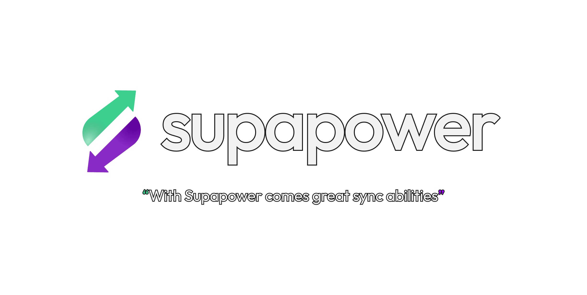

<picture>
  <source srcset="assets/supapower-dark.png" media="(prefers-color-scheme: dark)">
  <source srcset="assets/supapower-light.png" media="(prefers-color-scheme: light)">
  
</picture>

# Supapower

Supapower is a sync engine that keeps a local [PGlite](https://pglite.dev/) database in sync with
[Supabase](https://supabase.com/), so an application can read and write locally and stay usable
while offline. It is inspired by [PowerSync](https://www.powersync.com/).

> **Status:** 0.3.0. Both directions of the sync work; the public API may still change before 1.0.

## Why Supapower

- **Nothing new to deploy** - Supabase's Data API and Realtime _are_ the sync protocol; no sync
  service, no replication slot, no second bill.
- **Real Postgres on both ends** - the client is PGlite, not SQLite: the same SQL, the same
  types, and migrations you can lift from the server.
- **Your RLS policies are the sync rules** - downloads and writes go through PostgREST as the
  signed-in user, so there is no second authorization language to keep in step.
- **Two-way sync that merges per column** - offline writes queue per transaction and upload only
  the columns that changed, so two people editing different fields of a row both keep their edit.
- **Three lines to adopt** - a PGlite extension plus one `sync()` call; no codegen, no schema DSL,
  no client-side query language to learn.
- **Small, permissive, batteries included** - Apache-2.0 with zero runtime dependencies, plus a
  `SharedWorker` multi-tab host, React and Vue bindings, and a typed status and event API.

Longer version, and how it compares with PowerSync, Electric and Zero:
[supapower.dev/why-supapower](https://supapower.dev/why-supapower/) ·
[supapower.dev/comparison](https://supapower.dev/comparison/)

## Documentation

Everything below, except the [examples section](#examples), is for working with the monorepo. For documentation on the Supapower library see the [`supapower` package's readme](./packages/supapower/README.md), or the full documentation site at [supapower.dev](https://supapower.dev/).

## Packages

| Package                                   | Description                                                                                                                                                               |
| ----------------------------------------- | ------------------------------------------------------------------------------------------------------------------------------------------------------------------------- |
| [`supapower`](./packages/supapower/)      | The main package for Supapower - a PGlite extension that integrates with Supabase and syncs data between them                                                             |
| [`@supapower/worker`](./packages/worker/) | A more stable drop-in replacement for PGlite's built-in multi-tab worker, using a `SharedWorker` with automatic fallback - works with plain PGlite, no Supapower required |
| [`@supapower/react`](./packages/react/)   | React hooks for Supapower: PGlite live queries plus sync status                                                                                                           |
| [`@supapower/vue`](./packages/vue/)       | Vue composables for Supapower: PGlite live queries plus sync status                                                                                                       |

## Examples

| Example                           | Description                                                                                                               |
| --------------------------------- | ------------------------------------------------------------------------------------------------------------------------- |
| [`chat`](./example/chat/)         | A terminal chat app, showing a two-way sync between Supabase and PGlite                                                   |
| [`vue-chat`](./example/vue-chat/) | A browser chat app, showing `@supapower/worker`'s multi-tab `SharedWorker` and a two-way sync between Supabase and PGlite |

## Requirements

- [Bun](https://bun.com/) 1.4 or later, used as package manager, test runner and script runner
- Node.js 22 or later or a modern browser for consumers of the published packages

## Getting started

```bash
bun install
bun run check
```

`bun run check` runs the same four steps as continuous integration: lint, format check, typecheck and
tests.

## Scripts

| Script                  | What it does                                                  |
| ----------------------- | ------------------------------------------------------------- |
| `bun run build`         | Compiles every package to `dist` with the TypeScript compiler |
| `bun run typecheck`     | Typechecks every package, tests included                      |
| `bun test`              | Runs the test suite with the Bun test runner                  |
| `bun run test:coverage` | Runs the test suite and reports coverage                      |
| `bun run lint`          | Lints with Oxlint                                             |
| `bun run lint:fix`      | Lints and applies the fixes Oxlint can make safely            |
| `bun run format`        | Formats the repository with Oxfmt                             |
| `bun run format:check`  | Fails when a file is not formatted                            |
| `bun run changeset`     | Describes a change so it can be released                      |
| `bun run clean`         | Removes build output                                          |

## Toolchain

Everything is ESM and TypeScript. There is no CommonJS output and no bundler in the build.

- **Bun** for dependency installation, workspaces, scripts and tests
- **TypeScript 7** for typechecking and for emitting JavaScript and declarations
- **Oxlint** and **Oxfmt** for linting and formatting
- **Husky** and **lint-staged** to lint and format staged files on every commit
- **Changesets** for versioning and publishing

## License

[Apache-2.0](LICENSE), Copyright 2026 Aboviq AB.
