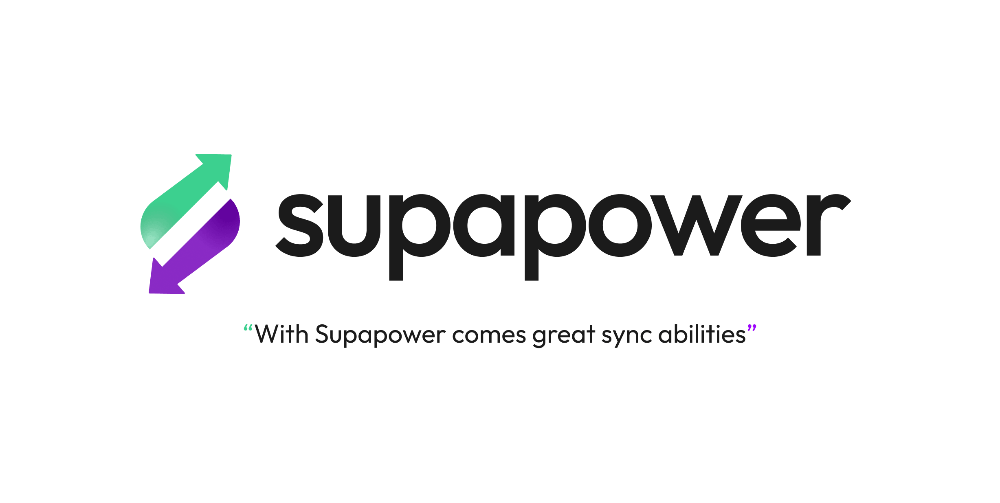

<picture>
  <source srcset="../../assets/supapower-dark.png" media="(prefers-color-scheme: dark)">
  <source srcset="../../assets/supapower-light.png" media="(prefers-color-scheme: light)">
  
</picture>

# `supapower`

The core for [Supapower](https://github.com/aboviq/supapower), a sync engine that keeps a
local PGlite database in sync with Supabase inspired by PowerSync.

> **Status:** early groundwork. The public API is still taking shape and will change.

## How it works?

Supapower is using [Supabase's Data API and JavaScript client](https://supabase.com/docs/reference/javascript) for syncing outgoing changes to Supabase, i.e. syncing local PGlite table changes to remote tables in Supabase's PostgreSQL database.

Local writes to tracked tables are recorded by statement triggers into a `supapower.changes` queue, one row per change, grouped by the transaction they were made in. The queue is drained in order, one local transaction at a time, but each change in a transaction is sent individually to Supabase as the API doesn't support transactions.

The Data API is also used for initially syncing data, and after the initial sync the local PGlite tables are kept up to date via [Supabase's Realtime](https://supabase.com/docs/guides/realtime) engine.

> [!IMPORTANT]
> For all tables you want to sync both the Data API and Realtime must be enabled.

> [!CAUTION]
> You really should enable [Row Level Security](https://supabase.com/docs/guides/database/postgres/row-level-security) for all synced tables to avoid unwanted access.

## Installation

Supapower needs both `@supabase/supabase-js` and `@electric-sql/pglite` as peer dependencies, so install them and `supapower` with:

```bash
npm install supapower @electric-sql/pglite @supabase/supabase-js
```

## Usage

### 1. Set up your Supabase client

Follow [Supabase's JavaScript Client Library install instructions](https://supabase.com/docs/reference/javascript/installing).

After you have set up your Supabase client, let's assume your client code looks something like this:

```ts
// ./supabase.ts
import { createClient } from '@supabase/supabase-js';

export const supabase = createClient('https://xyzcompany.supabase.co', 'your-publishable-key');
```

### 2. Set up PGlite

Follow [PGlite's Multi-tab Worker setup instructions](https://pglite.dev/docs/multi-tab-worker) and use the IndexedDB VFS which is recommended at the moment.

This will give you two more files: `pglite-worker.ts` and `pglite.ts`:

```ts
// ./pglite-worker.ts
import { PGlite, IdbFs } from '@electric-sql/pglite';
import { worker } from '@electric-sql/pglite/worker';

worker({
  async init() {
    const pg = new PGlite({
      fs: new IdbFs('your-app'),
      relaxedDurability: true,
    });

    // Preferable run any database migrations here...

    return pg;
  },
});
```

> [!NOTE]
> there are a few recommendations regarding how you create your database tables, see [database migrations](#database-migrations) below.

```ts
// ./pglite.ts
import { PGliteWorker } from '@electric-sql/pglite/worker';

export const pg = await PGliteWorker.create(
  new Worker(new URL('./pglite-worker.ts', import.meta.url), {
    type: 'module',
  }),
);
```

### 3. Add the Supapower extension to PGlite

Modify your PGlite client configuration to the following:

```diff
// ./pglite.ts
import { PGliteWorker } from '@electric-sql/pglite/worker';
+ import { supapower } from 'supapower';

export const pg = await PGliteWorker.create(
  new Worker(new URL('./pglite-worker.ts', import.meta.url), {
    type: 'module',
  }),
+ {
+   extensions: {
+     supapower,
+   },
+ },
);
```

### 4. Start the synchronization with Supabase

```ts
import { pg } from './pglite.js';
import { supabase } from './supabase.js';

const sync = await pg.supapower.sync({
  supabase,
  tables: ['todos', 'lists'],
});

// And to stop the synchronization:
sync.unsubscribe();
```

### 5. Execute queries and profit

To really see the full sync loop in action you can use the [Live Queries](https://pglite.dev/docs/live-queries) extension for PGlite and open your app in two browsers or add rows using Supabase Studio.

When you have set up the `live` extension with PGlite, you can execute live queries to see real-time updates in your application.

Execute a live query:

```ts
await pg.live.query({
  query: 'SELECT * FROM todos',
  callback: (result) => {
    console.log(result.rows);
  },
});
```

Add a row to the `todos` table to see the live query result being logged to the console:

```ts
await pg.sql`INSERT INTO todos (title) VALUES (${'Test Supapower'})`;
```

Do the same from a different browser or from Supabase Studio and notice the live query result updating in the console.

**There you have it!**

## API

Supapower is a PGlite extension that extends the PGlite instance with a `supapower` namespace.

See each section below for the API specification of each method (or property) in the `supapower` namespace.

### `supapower.sync`

The main method of the namespace which both initiates the local PGlite database and starts the synchronization with Supabase.

Creates a `supapower` schema in the database with a generic `supapower.changes` table that will contain all unsynced outgoing local changes to tracked tables.

For each tracked table a statement trigger is attached for `INSERT`, `UPDATE` and `DELETE` operations that adds a row to sync to the `supapower.changes` table.

When the database is set up the sync is started. The outgoing queue is drained one local transaction at a time using the provided `supabase` client, and the loop is woken by a `NOTIFY` from the change trigger rather than by polling.

A realtime channel subscription is also set up on the provided `supabase` client to track remote changes to the tracked tables, and an initial download brings the local tables up to date behind it. Incoming changes are applied in the order they were broadcast, with the change triggers suppressed so an incoming change is not queued straight back up as an outgoing one.

The channel is subscribed to before the download starts, so a change made while the download is in flight queues up behind the snapshot instead of falling in the gap between the two.

Call it in **every** tab. The schema has to exist wherever writes happen, and the tab in charge of draining the queue may change at any time - see [Multi-tab behavior](#multi-tab-behavior) below.

#### Type signature

```ts
function supapower.sync(options: SupapowerSyncOptions): Promise<SupapowerSync>;
```

The returned promise resolves once the schema is in place and the sync has been started, not once anything has been synced.

#### Related types

##### `SupapowerSyncOptions` - The Supapower options

```ts
interface SupapowerSyncOptions {
  supabase: SupabaseClient;
  tables: Array<SupapowerTableConfig | string>;
  /**
   * An optional AbortSignal to cancel the synchronization process.
   *
   * Aborting it is equivalent to calling `unsubscribe()`.
   */
  signal?: AbortSignal;
  /**
   * Scopes the cross-tab lock that keeps a single tab in charge of the queue.
   *
   * Only used for a plain `PGlite` instance - see "Multi-tab behavior".
   *
   * @default "default"
   */
  scope?: string;
  /**
   * Decides what happens to a batch Supabase rejects for good.
   *
   * @default Discards the batch.
   */
  onUnrecoverableError?: (context: UnrecoverableUploadError) => void | Promise<void>;
  /**
   * Called for anything that went wrong but did not stop the sync.
   *
   * Without it every one of those passes silently.
   */
  onError?: (error: SupapowerError) => void;
}
```

For tables provided as a `string`, they are expected to have a primary key column named `"id"`. To use another primary key column name, use the `{ table: string; primaryKey?: string }` notation.

The initial sync is performed in the specified order of the tables provided in the `tables` array.

> [!NOTE]
> The initial sync downloads whole rows and upserts them on the primary key, which makes re-running it harmless. Configure [`cursor`](#table-cursor-configuration) to make it ask for only what changed; without it, every start pulls the whole table. Either way it never deletes - a row hard deleted remotely while this client was away only disappears locally on the next truncation.

##### `SupapowerSync` - The sync handle

```ts
interface SupapowerSync {
  /**
   * How the single active syncer is elected across tabs and processes.
   */
  readonly leadership: 'worker-leader' | 'web-lock' | 'single-process';
  /**
   * Stops the synchronization process. Local changes are still
   * tracked. Safe to call more than once.
   */
  unsubscribe(): void;
}
```

##### `SupapowerTableConfig` - Tracked tables configuration

```ts
interface SupapowerTableConfig {
  table: string;
  /**
   * @default "id"
   */
  primaryKey?: string;
  /**
   * Timestamp column that moves on every write, e.g. "updated_at".
   *
   * Given one, the download after the first only asks for what changed.
   */
  cursor?: string;
  /**
   * @default "authenticated"
   */
  access?: 'anon' | 'authenticated';
}
```

###### Table `cursor` configuration

Without a `cursor` every start downloads the whole table. Point it at a timestamp column that is set to the current time on every write and the download after the first only asks for rows at or after the last value it saw:

```ts
{ table: 'todos', cursor: 'updated_at' }
```

Supabase has no built-in "give me everything since" - the Data API only queries the table as it stands, and Realtime never replays what you missed - so this column is what makes an incremental download possible at all.

Two things to know about it:

- **The download reaches a minute further back than the last value it saw.** A write stamps its timestamp with the transaction's start time but only becomes visible when it commits, so a slow transaction can land a row behind a watermark that has already moved past it. The margin covers transactions up to a minute; anything slower is missed until the table is downloaded whole again.
- **Hard `DELETE`s cannot be picked up this way.** The row is simply gone, so nothing comes back to say so. Use soft deletes, and read the schema recommendations below.

The watermark is per table and is forgotten whenever the table is truncated, so a user change always starts from a whole download.

###### Table `access` configuration

The `access` configuration for a table controls what happens when a user signs in or out from Supabase (via the [`supabase.auth` API](https://supabase.com/docs/guides/auth)).

- `authenticated` (default) - truncates the table on user sign in and sign out, i.e. it's expected to be user dependent and won't be synced at all if there is no authenticated user
- `anon` - never truncates the table and it's synced even when there's no authenticated user

The realtime subscription follows this setting: `anon` tables are subscribed to at all times, the rest only while somebody is signed in. It is rebuilt when the signed in user changes, and deliberately left alone when only the access token was refreshed - supabase-js pushes a refreshed token onto the realtime socket by itself, so re-subscribing would drop messages for nothing.

A client created with the [`accessToken` option](https://supabase.com/docs/reference/javascript/initializing) owns its own token and has no auth state to follow, so all of its tables are treated as reachable.

When the signed in user changes - in either direction - the `authenticated` tables are truncated before anything is downloaded for the new one, and the outgoing queue is cleared of their changes too.

> [!CAUTION]
> Unsynced local writes to `authenticated` tables are lost on sign out. They were made by the previous user and cannot be pushed upstream as the next one, so they go with the rows. Push what matters before signing out.

**Example:**

```ts
await pg.supapower.sync({
  supabase,
  tables: [
    'items', // tracks table "items" with primary key "id"
    { table: 'todos' }, // tracks table "todos" with primary key "id"
    { table: 'tags', primaryKey: 'tag_id' }, // tracks table "tags" with primary key "tag_id"
    { table: 'notes', cursor: 'updated_at' }, // only downloads what changed since last time
    { table: 'plans', access: 'anon' }, // tracks table "plans" and it will be synced even when a user hasn't signed in
  ],
});
```

### Multi-tab behavior

Every tab that opens the same PGlite database shares one set of files, and therefore one
`supapower.changes` queue. Exactly one tab may drain it, otherwise the same batch is pushed twice.

That lock cannot live in Postgres. PGlite is a single-connection engine and every tab runs its own
instance, so `pg_advisory_lock()` is invisible to the other tabs and would block the only connection
this one has. Supapower coordinates in the browser instead, and picks the strongest mechanism the
runtime offers:

| `leadership`     | When                                   | Mechanism                                                                                                                  |
| ---------------- | -------------------------------------- | -------------------------------------------------------------------------------------------------------------------------- |
| `worker-leader`  | The database is a `PGliteWorker`       | PGlite's own leader election - the tab that hosts the database                                                             |
| `web-lock`       | A plain `PGlite` instance in a browser | An exclusive [Web Lock](https://developer.mozilla.org/en-US/docs/Web/API/Web_Locks_API) named `supapower:outgoing:<scope>` |
| `single-process` | Node, Bun, Deno                        | None - a second process is assumed not to exist                                                                            |

Leadership is handed over on its own: a Web Lock is released by the browser when the tab closes or
crashes, and `PGliteWorker` re-runs its election. The waiting tab takes over and resumes draining
where the previous one left off. Read `sync.leadership` to see which mechanism you ended up with.

> [!IMPORTANT]
> Use the [multi-tab worker](https://pglite.dev/docs/multi-tab-worker) as shown in [step 2](#2-set-up-pglite).
> Opening a plain `PGlite` instance against the same `dataDir` from several tabs risks corrupting the
> database no matter what Supapower does with the queue, the `web-lock` strategy only keeps two tabs from
> pushing the same changes.

### Error handling

A failed upload is one of two things, and Supapower treats them differently.

**Transient** - offline, a 5xx, a dropped connection. The batch stays queued and is retried with an
exponential backoff, from 1 second up to a minute.

**Unrecoverable** - a data type mismatch (Postgres class `22`), an integrity constraint violation
(class `23`) or a row-level security denial (`42501`). Supabase will reject these the same way every
time, and because the queue is strictly ordered the batch would block every later change behind it
forever. By default Supapower discards the whole batch to keep the queue moving.

Override that with `onUnrecoverableError` when losing the data is not acceptable:

```ts
import type { UnrecoverableUploadError } from 'supapower/changes';

const sync = await pg.supapower.sync({
  supabase,
  tables: ['todos'],
  onUnrecoverableError: async ({ error, batch, change, commit }) => {
    await reportToSentry(error, { change });
    await saveForLater(batch);
    await commit(); // drops the batch from the queue
  },
});
```

```ts
interface UnrecoverableUploadError {
  /** The failure, with the PostgREST error itself as `error.cause`. */
  readonly error: SupapowerUploadError;
  /** Every change in the local transaction that failed, in order. */
  readonly batch: Readonly<ChangeRow[]>;
  /** The change that was rejected. */
  readonly change: ChangeRow;
  /** Drops the whole batch from the outgoing queue. */
  readonly commit: () => Promise<void>;
}
```

Returning without calling `commit()` leaves the batch queued, and the sync retries it after a
backoff - use that to park a batch rather than lose it, but expect the callback to fire again.

> [!CAUTION]
> Discarding is not a rollback. The changes **before** the rejected one in the batch are already
> upstream, so dropping the batch leaves that transaction half applied in Supabase with nothing
> locally to say so. Treat `onUnrecoverableError` as the last chance to notice a divergence.

Uploads are idempotent by design - `upsert` on the primary key, `delete` by primary key - because a
crash between the upload and the queue delete leaves the batch queued for the next leader to send
again.

#### Everything else

Anything that goes wrong without stopping the sync goes to `onError`, and without it passes silently:
an upload or download that failed and will be retried, a realtime channel reporting trouble, a change
that could not be applied locally, and a `DELETE` that matched no row upstream.

It is always a `SupapowerError`, never a bare `unknown`. Whatever was actually thrown - a `TypeError`
from `fetch`, a PGlite error, a string - is wrapped and kept as `cause`, so there is a `code` to
switch on without narrowing anything first:

```ts
const sync = await pg.supapower.sync({
  supabase,
  tables: ['todos'],
  onError: (error) => {
    switch (error.code) {
      case 'delete_ignored':
        // Local and remote have diverged; the row is still upstream.
        break;
      case 'connection_failed':
        setOffline(true);
        break;
      default:
        report(error.message, { cause: error.cause });
    }
  },
});
```

| `code`              | What happened                                                    |
| ------------------- | ---------------------------------------------------------------- |
| `upload_failed`     | Something in the outgoing pipeline failed and will be retried    |
| `download_failed`   | Reading from Supabase failed                                     |
| `apply_failed`      | A remote change could not be written into the local database     |
| `connection_failed` | The realtime channel could not be reached or stay joined         |
| `delete_ignored`    | Supabase accepted a `DELETE` that matched no row                 |
| `schema_mismatch`   | A queued change names a table that is not configured for syncing |

`asSupapowerError(value, message, code)` from `supapower/errors` is the same wrapper, if you want to
funnel your own failures into the same shape.

That last one is worth knowing about. Row-level security refuses a delete by filtering the row out of
the policy's `USING` clause, not by raising, so a denied `DELETE` comes back as a perfectly ordinary
success that removed nothing. Supapower asks PostgREST to count what it removed and reports a
definite zero as `delete_ignored`.

It is reported rather than thrown, because a batch re-sent after a crash legitimately deletes nothing
the second time and failing there would wedge the queue on a change that can never succeed again.
That also means the two cases are indistinguishable from the client: `delete_ignored` means _either_
the row was already gone _or_ the delete was refused.

### Entry points

Everything needed for the common case is on the package root. The rest is split per module so that
go-to-definition lands on the definition rather than on a re-export.

| Import                 | Contains                                                                               |
| ---------------------- | -------------------------------------------------------------------------------------- |
| `supapower`            | `supapower` (the extension), `createSupapower`                                         |
| `supapower/types`      | `SupapowerSyncOptions`, `SupapowerSync`, `SupapowerTableConfig`, `PGliteWithSupapower` |
| `supapower/changes`    | `ChangeRow`, `UnrecoverableUploadError`, `SyncTransaction`                             |
| `supapower/errors`     | `SupapowerError`, `SupapowerUploadError`, `asSupapowerError`, the guards and codes     |
| `supapower/leadership` | `createLeadership` and the individual strategies                                       |

`createSupapower(pg)` is the same code path as the extension, for when registering an extension is
not an option:

```ts
import { createSupapower } from 'supapower';

const sync = await createSupapower(pg).sync({ supabase, tables: ['todos'] });
```

## Database migrations

As Supapower uses PGlite, which is a PostgreSQL database, you could easily copy your database migration queries from Supabase to the client and it will work, but it's not recommended without slightly modifying them.

The key difference with client databases and backend databases is that you'll eventually end up with many different versions of the client application. Either because of caches, or because users doesn't always immediately update their app when a new version is available.

This places higher demands on backward and forward compatibility and there are some tricks below you can use to ease maintenance and avoiding database errors.

### Schema recommendations

Here are some recommendations when writing your migrations to make the most out of Supapower and to avoid any schema or data issues.

Recommendations are for either the client (<kbd>C</kbd>) or the server (<kbd>S</kbd>) or both.

- <kbd>C</kbd> make all columns nullable, except the primary key
  - if you're really sure some other columns will never ever be missing in the future (like `created_at`) you can keep them non-nullable as well
- <kbd>C</kbd> remove all foreign key constraints
  - keep the columns, but remove the constraints as we don't know in which order rows will be synced
- <kbd>C</kbd><kbd>S</kbd> prefer soft deletes over `DELETE` queries, i.e. use a `deleted_at` column or similar and filter all queries with it
  - this recommendation is for the Supabase migrations as well because realtime events for deleted rows are not sent by default (see [Delete events limitation](https://supabase.com/docs/guides/realtime/postgres-changes#delete-events))
  - even if delete events are received via the realtime engine they will only sync to online users, this means that rows deleted by other users while you are offline will still be in your client's database
  - **bump `updated_at` in the same statement that sets `deleted_at`**, otherwise the deletion never reaches a client that is using [`cursor`](#table-cursor-configuration): an incremental download only asks for rows whose timestamp moved, so a soft delete that leaves `updated_at` alone is invisible to every client that was offline when it happened
- <kbd>C</kbd><kbd>S</kbd> give every synced table an `updated_at` column maintained by a trigger
  - a trigger rather than application code, so that no write path can forget it - one missed update is a row that silently stops syncing to offline clients
  - it is what [`cursor`](#table-cursor-configuration) needs to turn the full download on every start into an incremental one
- <kbd>C</kbd><kbd>S</kbd> use uuid's as primary keys
  - as the primary key is shared between the client and server databases and can be created at any end they shouldn't be able to collide, which is why a sequence number won't work
- <kbd>C</kbd><kbd>S</kbd> have a single primary key in every table that you want to sync
  - support for compound primary keys in Supapower has not been implemented yet
  - from my experience even when you want compound primary keys it's usually better to have a single PK with a unique key for the compound keys instead

Conclusion: relax your client database schema, use soft deletes and always use single primary keys as `uuid` columns.

## License

[Apache-2.0](LICENSE), Copyright 2026 Aboviq AB.
